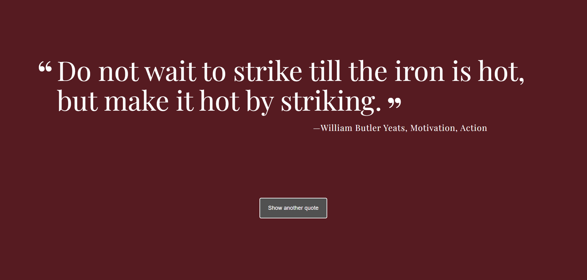

# 💬 Random Quotes Generator

> A dynamic JavaScript application that displays random inspirational quotes with automatic background colour changes for an engaging user experience.

📸 Preview

---

## 👀 Why This Project Stands Out

- Random quote generation without repetition  
- Automatically changes background colour on every quote  
- Quotes refresh automatically every 10 seconds  
- Responsive typography for mobile and desktop  
- Demonstrates strong JavaScript fundamentals and DOM manipulation  

---

## 🛠️ Tech Stack

- **HTML5** – Semantic structure  
- **CSS3** – Custom styling, animations, and responsive design  
- **JavaScript (Vanilla)** – Logic, events, timers, and data handling  
- **Google Fonts** – Playfair Display for elegant typography  

---

## ✨ Features

- Displays inspirational and motivational quotes  
- Ensures quotes are not repeated until all have been shown  
- Random background color generated using hex values  
- Auto-refresh quotes every 10 seconds  
- Button click to manually load a new quote  
- Responsive layout using media queries  

---

## 🧠 What I Learned

- Managing **arrays and objects** in JavaScript  
- Preventing repetition using **state tracking**
- Using **event listeners** and **setInterval**
- Dynamically updating the DOM
- Generating **random values** (quotes & colors)
- Writing cleaner, modular JavaScript code

> 📌 This project was built as one of the challenges by the TeamTreehouse course for Front End Development, helping reinforce JavaScript fundamentals and best practices through hands-on implementation.

---

## ⚙️ How to Run Locally

1. Clone the repository  
   ```bash
   git clone https://github.com/FrontEndHighRoller/random-quote-generator.git
2. Open index.html in your browser
3. Resize the screen to see responsive layouts and image switching in action 🎯

---

🏆 Challenge Credit
Challenge by Frontend Mentor
https://www.frontendmentor.io

---

🙋‍♂️ Author
Dennis Rumanek

GitHub: https://github.com/FrontEndHighRoller

LinkedIn: https://www.linkedin.com/in/dennis-rumanek/

⭐ If you like this solution, feel free to star the repository!
